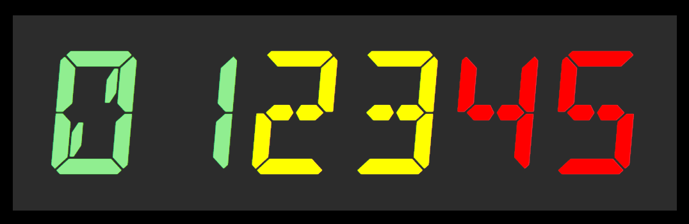
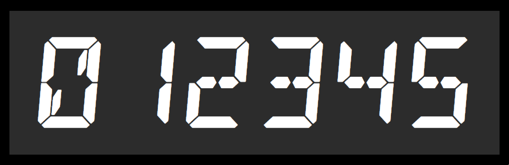
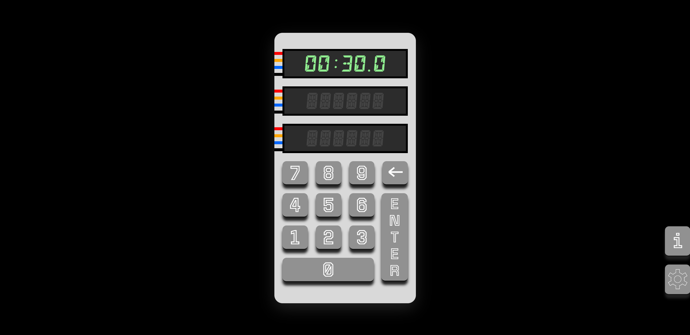
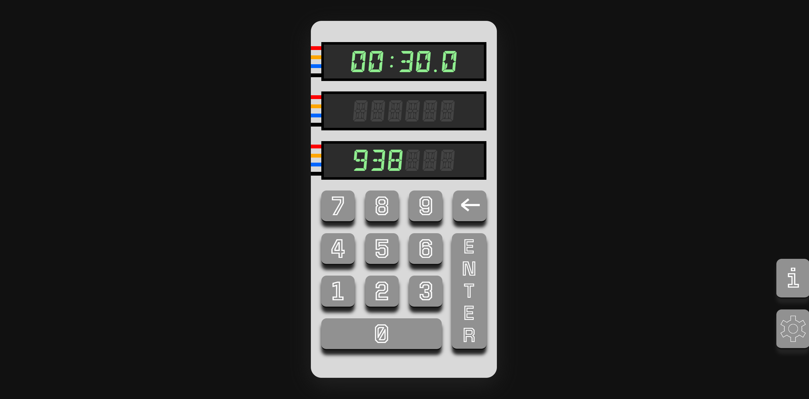
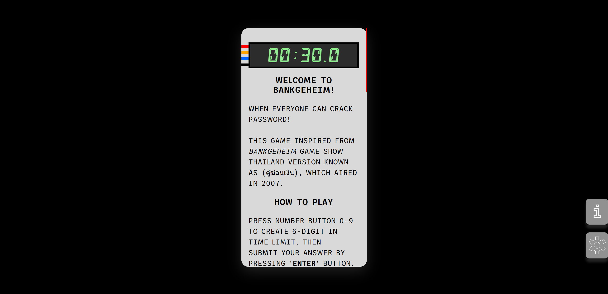
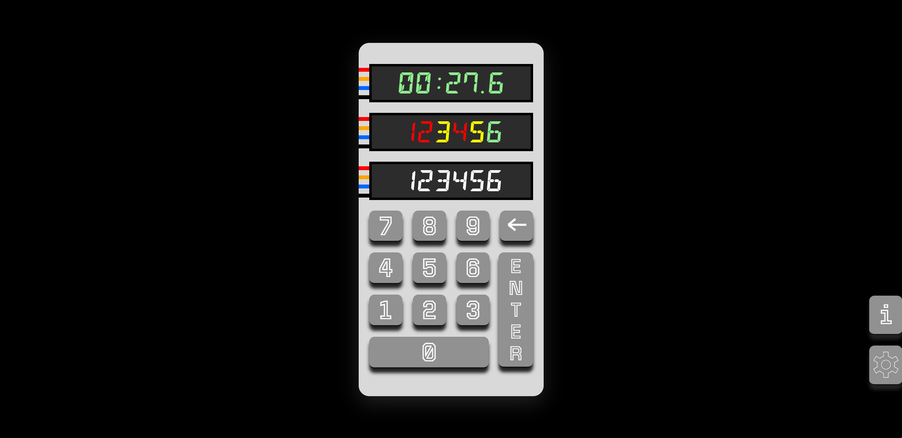
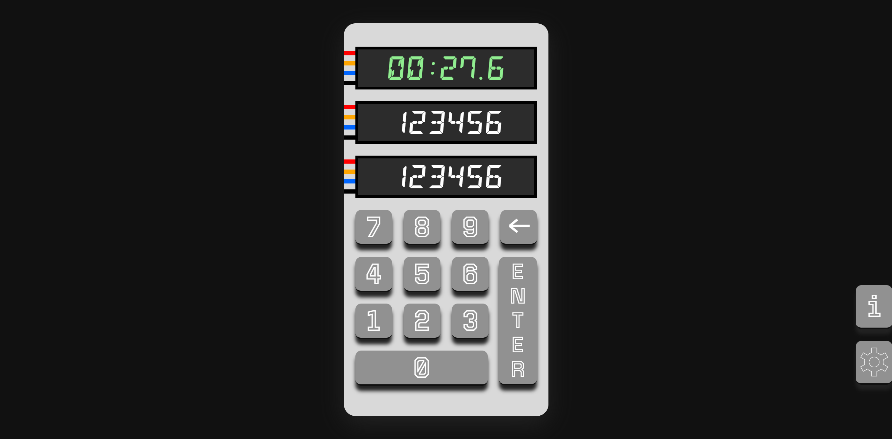
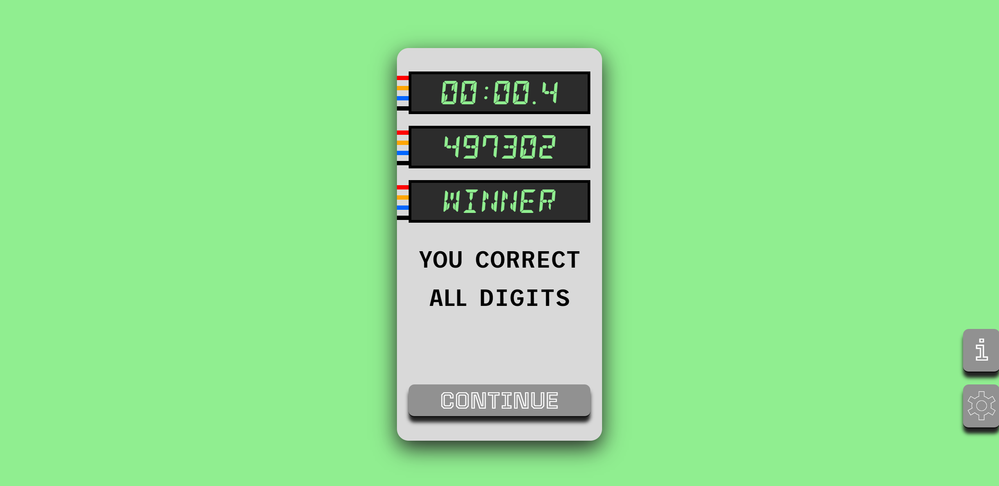
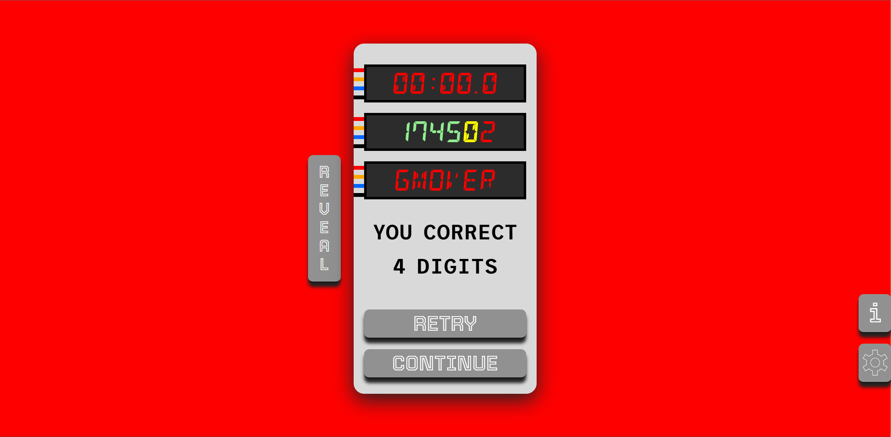

# BankGeheim-game

*What if password vault have a hint!* - cd-999

---

## Introduction

This game was inspired by the BankGeheim game show, the Thailand version known as (ตู้ซ่อนเงิน), which aired on Television 5 in 2007, as shown below.

[Game concept from Thai gameshow](https://youtu.be/v1ipLZlqaLw?si=n3-Ael5C0t_4PLrB&t=2216 "Game concept from gameshow]")

## Tech Stack

* Vanilla JS
* jQuery

## How to play

When a player joins the game, it starts when the user clicks or presses a number 0 to 9 button to input 6 digits on the screen.

Press the **ENTER** button when player fills in all the digits; the result will be displayed in the following colors.

The colors when reveals in each digit are.

* 🟢 **GREEN** - Right number and right digit.
* 🟡 **YELLOW** - Right number but wrong digit.
* 🔴 **RED** - The number does not exist.
* ⚪️ **WHITE** - Player input digit screen or [Pure Guess mode*.](#pure-guess)

Press **<- (BACKSPACE)**, **- (MINUS)**, or **DELETE** when the player has submitted the answer to retake the numbers and correct any mistakes that match the intended solution.

Winning in this game involves correcting all digits and submitting the answer within the time limit. 

If you lose, players can retry to select numbers freely without a time limit and reveal numbers that sparkled in their minds.

<h3 id="pure-guess">*Pure guess mode</h3>

Player can freely guess number without any guidance, when all text are **WHITE!**

Trust you instincts and sixth sense to discover the correct digit and numbers!
Seek out this mode and various settings by clicking **SETTINGS** button.

### Settings

In settings. Player can set the timer of game, also retriving assist number as a starter that exacts to correct digit, maximum of assist is three digits.
Setting duplicate number which changes gamestyle of entering numbers. 
Pure guess mode which drastically change gameplan as explained [here.](#pure-guess)

*Settings page*

## Demonstration

*Default main game*

*Default main game with assisting number on 3 digits*

*Infomation of game, which is on rightside of page as (i)*

*Players submit answer and show the result*

*The result in Pure guess mode*

*Player gets all number digit correct*

*Player cannot get all number digit correct in time limit*

## Design concept 

For design concept was created in Figma. [here](https://www.figma.com/file/YYtTagj8M2UvTELBdV68b0/Vault-Game?type=design&node-id=1%3A2&mode=design&t=FoXk1XmeVvppDxGC-1 "Figma design concept")

## Future works

* Create the calculating score and keeping high score in local machine.
* Connecting to database to compete score with all players.
